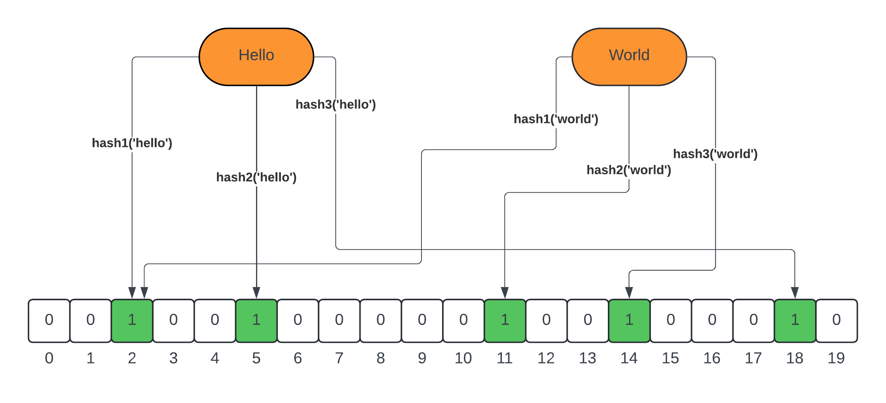

# Bloom Filter

This repository contains a simple [bloom filter's](https://medium.com/@satviknema/what-the-heck-is-a-bloom-filter-anyway-ee392818f2b2) implementation in java

Simply clone the repository and run the tests:
```bash
mvn clean install
```
Compiled on java 21

Refer [this blog](https://medium.com/@satviknema/implementing-a-bloom-filter-in-java-from-scratch-878976f3e530) for a detailed explanation for how it works


